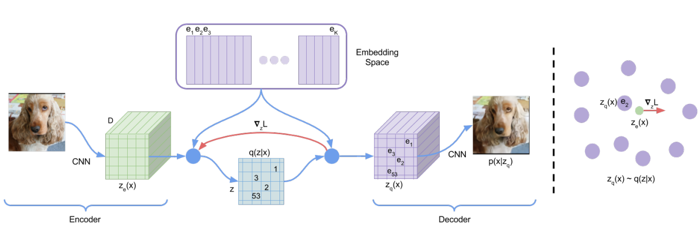
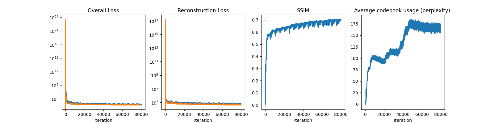
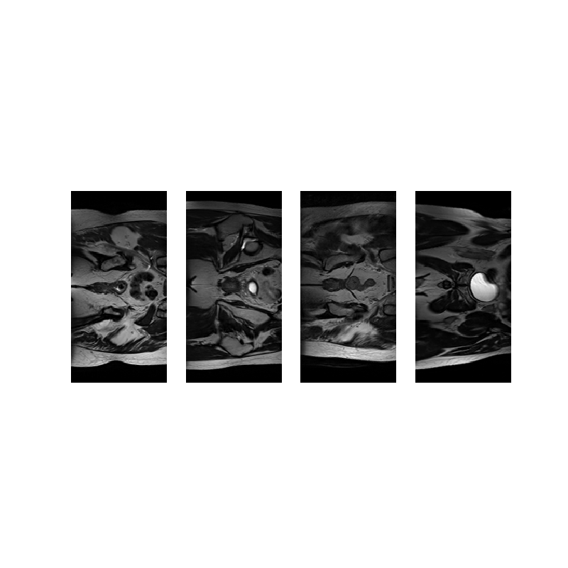
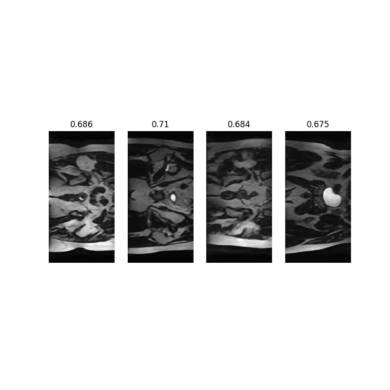
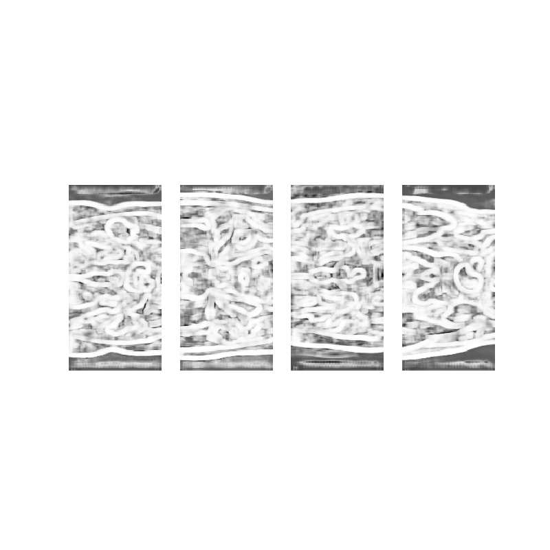

# HipMRI Image Generation with VQVAE

## Introduction
This project implements a [Vector Quantised Variational Autoencoder (VQVAE)](https://arxiv.org/abs/1711.00937) generative model for the [HipMRI Study on Prostate Cancer](https://doi.org/10.25919/45t8-p065) using processed 2D slices. The model produces reasonably clear images with a [Structural Similarity Index Measure (SSIM)](https://en.wikipedia.org/wiki/Structural_similarity_index_measure) of over 0.6.

## Project Structure
```
.
├── README.md
├── dataset.py      # Data loading and preprocessing
├── modules.py      # Model components
├── train.py        # Training, validating, testing and saving model
├── predict.py      # Prediction and visualisation
├── utils.py        # Helper functions
├── images          # Images of inputs, outputs and plots
```

## Dependencies
As listed in requirements.txt:
- python (3.11.13)
- torch (2.8.0)
- torchvision (0.23.0)
- numpy (2.2.6)
- pillow (9.4.0)
- opencv-python (4.12.0.88)
- matplotlib (3.10.6)
- nibabel (5.3.2)
- scikit-image (0.25.0)
- scipy (1.16.2)

## Installation

1. Install `python 3.11.13` 
2. Clone repository
```bash
git clone <repository-url>
cd <repository-name>
```
3. Create a conda or virtual environment with `python 3.11.13`
```bash
conda create --name myenv python=3.11.13
conda activate myenv
```
4. Install `pip`
```bash
conda install pip
```
5. Install dependencies using the `requirements.txt`
```
pip install -r requirements.txt
```
4. Prepare HipMRI dataset in the following structure at your preferred location. Specify absolute path to dataset when running model on command line.
```
├──keras_slices_data/
|  ├──keras_slices_test
|  ├──keras_slices_train
|  ├──keras_slices_validate
```
## Use
To run the VQVAE run `python3 train.py`. Incude the `-save` flag to save the model. Add parameters in the command line. Default values are specified as:
```bash
parser.add_argument("--data_path", type=str, default='/home/groups/comp3710/HipMRI_Study_open/keras_slices_data')
parser.add_argument("--batch_size", type=int, default=32)
parser.add_argument("--n_updates", type=int, default=80000)
parser.add_argument("--n_hiddens", type=int, default=256)
parser.add_argument("--n_residual_hiddens", type=int, default=64)
parser.add_argument("--n_residual_layers", type=int, default=2)
parser.add_argument("--embedding_dim", type=int, default=32)
parser.add_argument("--n_embeddings", type=int, default=256)
parser.add_argument("--beta", type=float, default=.25)
parser.add_argument("--learning_rate", type=float, default=3e-1)
parser.add_argument("--log_interval", type=int, default=50)

parser.add_argument("-save", action="store_true")
parser.add_argument("--filename",  type=str, default=timestamp)
```

To visualise results  run `python3 predict.py`. Add parameters in the command line. Default values are specified as:
```bash
parser.add_argument("--model_relative_path", type = str, default = '/vqvae_data_sun_oct_19_22_46_34_2025.pth')
parser.add_argument("--data_path", type=str, default='/home/groups/comp3710/HipMRI_Study_open/keras_slices_data')
parser.add_argument("--image_folder", type = str, default = '/keras_slices_test')
parser.add_argument("--n_predictions", type = int, default = 4)
```

## Reproducibility
The training loop and other operations use deterministic algorithms wherever possible. The predetermined data split ensures uniformity in multiple training and testing runs. The model trains for a default 80 000 epochs, longer than absolutely necessary to achieve the threshold accuracy to account for whether the randomised weights are initialised well or poorly.

## Architecture (algorithm and problem it solves)
- resnet
- quantiser
- encoder
    - batch norm
    - drop out
- decoder
- loss function


## Dataset
justify splits

pre-processing

## Performance
### Training


### Testing




## References
https://arxiv.org/abs/1711.00937

https://arxiv.org/abs/1512.03385