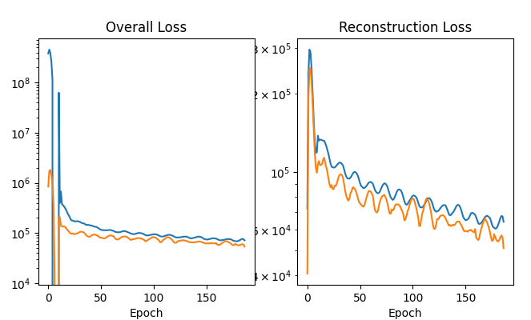
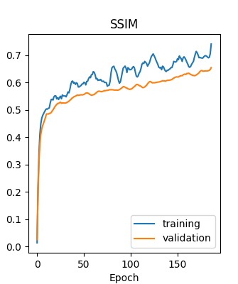
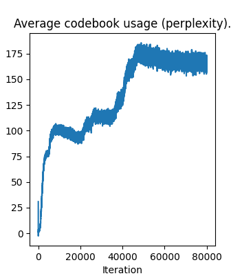
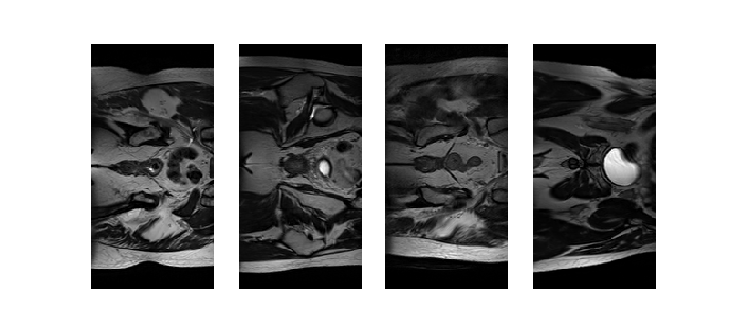
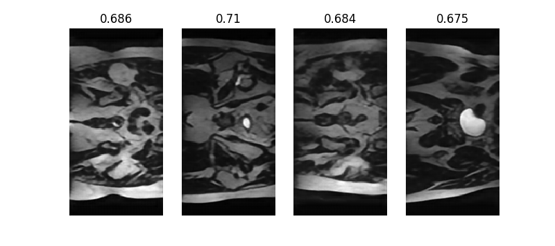
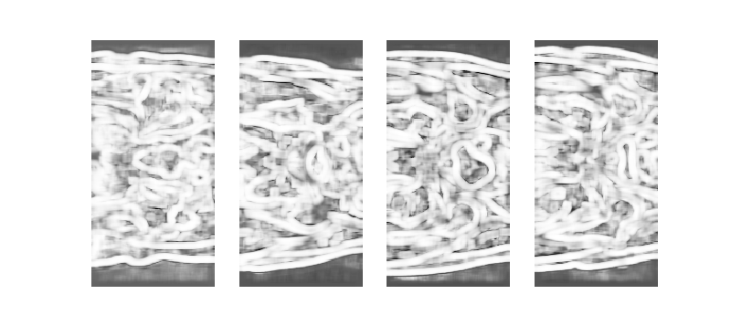

# VQ-VAE for HipMRI Study on Prostate Cancer

## Introduction
This project implements a [Vector Quantised Variational Autoencoder (VQ-VAE)](https://arxiv.org/abs/1711.00937) generative model for the [HipMRI Study on Prostate Cancer](https://doi.org/10.25919/45t8-p065) using processed 2D slices. The model produces reasonably clear images with a [Structural Similarity Index Measure (SSIM)](https://en.wikipedia.org/wiki/Structural_similarity_index_measure) of over 0.6.

The VQ-VAE is a generative model related to the variational autoencoder (VAE). Rather than learning the latent space as a certain prior distribution, the VQ-VAE learns it as a discrete set of vectors, called a codebook $^5$.

A generative model learns the probability distribution of the data, allowing sampling of new data points statistically consistent with the real dataset $^4$. We can sample from the VQ-VAE codebook using a PixelCNN to fit a distribution over the "pixel" values of the 1-channel latent space. This has been done [here](https://github.com/MishaLaskin/vqvae/blob/master/README.md) with the CIFAR10 dataset $^7$, demonstrating the capacity of the VQ-VAE as a generative model.

## Project Structure
```
.
├── README.md
├── dataset.py          # Data loading and preprocessing
├── modules.py          # Model components
├── train.py            # Training, validating, testing and saving model
├── predict.py          # Prediction and visualisation
├── requirements.txt    # List of dependencies
├── utils.py            # Helper functions
└── images/             # README.md assets
    ├── differences.png
    ├── loss.png
    ├── ssim.png
    ├── perplexity.png
    ├── original.png
    ├── prediction.png
    └── vqvae_architecture.png
```

## Usage
### Dependencies
As listed in requirements.txt:
- python (3.11.13)
- torch (2.8.0)
- torchvision (0.23.0)
- numpy (2.2.6)
- pillow (9.4.0)
- opencv-python (4.12.0.88)
- matplotlib (3.10.6)
- nibabel (5.3.2)
- scikit-image (0.25.0)
- scipy (1.16.2)

### Installation

1. Install `python 3.11.13` 
2. Clone repository
```bash
git clone <repository-url>
cd <repository-name>
```
3. Create a conda or virtual environment with `python 3.11.13`
```bash
conda create --name myenv python=3.11.13
conda activate myenv
```
5. Install dependencies using `requirements.txt`
```
pip install -r requirements.txt
```
4. Prepare HipMRI dataset with the following structure at your preferred location. Specify absolute path as command line argument when running model.
```
└──keras_slices_data/
   ├──keras_slices_test/
   ├──keras_slices_train/
   └──keras_slices_validate/
```
### Running
To run the VQ-VAE, run `python3 train.py -save` (`-save` flag to save model). Adjust hyperparameters in command line. Default values are:
```bash
parser.add_argument("--data_path", type=str, default='/home/groups/comp3710/HipMRI_Study_open/keras_slices_data')
parser.add_argument("--batch_size", type=int, default=32)
parser.add_argument("--n_updates", type=int, default=80000)
parser.add_argument("--n_hiddens", type=int, default=256)
parser.add_argument("--n_residual_hiddens", type=int, default=64)
parser.add_argument("--n_residual_layers", type=int, default=2)
parser.add_argument("--embedding_dim", type=int, default=32)
parser.add_argument("--n_embeddings", type=int, default=256)
parser.add_argument("--beta", type=float, default=.25)
parser.add_argument("--learning_rate", type=float, default=3e-1)
parser.add_argument("--log_interval", type=int, default=50)

parser.add_argument("-save", action="store_true")
parser.add_argument("--filename",  type=str, default=timestamp)
```

To visualise results  run `python3 predict.py`. Provide parameters in command line. Default values are:
```bash
parser.add_argument("--model_relative_path", type=str, default='/vqvae_data_mon_oct_27_06_15_11_2025.pth')
parser.add_argument("--data_path", type=str, default='/home/groups/comp3710/HipMRI_Study_open/keras_slices_data')
parser.add_argument("--image_folder", type=str, default='/keras_slices_test')
parser.add_argument("--n_predictions", type=int, default=4)
```

### Reproducibility
#### Hyperparameters
To reproduce the results of this report, the use the default hyperparameters. The training loop and other operations use deterministic algorithms wherever possible. Only model weights are radnomised at the beginning of training runs.

#### Dataset and data preprocessing
The model was trained on the [HipMRI Study for Prostate Cancer](https://doi.org/10.25919/45t8-p065). The data was pre-split into train, validate and test sets as follows:
- Train: cases 004_week_0 - 035_week_0 
- Validate: cases 036_week_0 - 039_week_7
- Test: cases 040_week_0 - 042_week_0

While the majority of the data was reserved for training, the test and validation sets were sufficient generate reliable metrics to evaluate the prformance of the model.

60 2D slices were derived from each 3D image, previously available [here](https://filesender.aarnet.edu.au/?s=download&token=76f406fd-f55d-497a-a2ae-48767c8acea2). 

To reproduce the results of this report, replicate these splits to ensure the model trains on the same data.

#### Computation specifications
Run on an NVIDIA A100 GPU on the Rangpur cluster, belonging to [The University of Queensland's High Performance Computing](https://rcc.uq.edu.au/systems/high-performance-computing#Training) resource.

## Algorithm
### VQ-VAE
The overall architecture resembles a standard VAE save for the Vector Quantisation step at the bottleneck.


_Figure 1: VQ-VAE architecture (left) and visualisation of emebdding space (right)._ $^1$

1. An embedding space $e$ is defined with $K$ latent embeddings of dimensionality $D$: $e_1, e_2, ..., e_K$
2. The model takes an input $x$
3. $x$ is passed through an encoder, producing $z_e(x)$
4. $z$, the discrete latent variables, are calculated by nearest neighbour look-up of the embedding space $e$

    The prior categorical distribution, $q(z|x)$ probabilities are defined as one-hot:
    
    $$q(z = k|x) = \begin{cases} 1, k = argmin_j||z_e(x) - e_j||_2 \\\\ 0, otherwise \end{cases}$$
    
    - 1 if $k = j$ (indices) where $j$ is the index of the embedding vector at a minimal distance from $z_e(x)$ (right of Figure 1)
    - 0 otherwise

5. Encoder output $z_e(x)$ is replaced with the embedding vector $z_q = e_k$
6. $z_q$ is passed through an decoder, producing $p(x|z_q)$
6. The model produces output $p(x|z_q)$ $^1$
### Encoder
Takes input $x$ and compresses it to a lower dimensional representation $z_e(x)$ by performing a series of linear transformations (Conv2d) and activation functions (ReLU) $^2$.

We use 7 convolutional layers to produce a field of 256 latents at 1/4 the input height and width.

### Quantiser
Takes encoder output $z_e(x)$ and converts it to a discrete latent representation by mapping it to the nearest embedding.

We initialise an embedding space of 256 latent embeddings ($e$) of dimensionality 32 with weights in range in range (-1/256, 1/256) sampled from a continuous uniform distribution.

The 256 latent vectors in $z_e(x)$ are flattened. For each flattened latent vector, we calculate its distance from each latent embedding. This is achieved efficiently by matrix multiplication of the flattened latent vectors and the latent embeddings according to formula:

$d = (z_{e(flattened)}(x) - e)^2 = z_{e(flattened)}(x)^2 + e^2 - 2\times e\times z_{e(flattened)}(x)$

The index of the minimum distance in $d$ for each latent vector is used to fetch the corresponding latent embedding from $e$. 

Fnally, the discrete latent variables ($z$) are reshaped to the original dimensions of $z_e(x)$.

To address the non-differentiability of $argmin$ during backpropagation, we use the following straight-through estimator. 

$z_q = z_e(x) + (z_q - z_e(x)).detach()$

This allows gradients to pass only through the identity path, treating quantisation as an identity function, so the encoder is directly updated using the decoder's gradient signal $^5$.

We calculate [embedding](#embed_loss) loss and [commitment](#comm_loss) loss are then calculated according to the succeeding formulas.

### Decoder
Takes embedding vector $z_q$ and attempts to reconstruct the original higher dimensional input $x$ by performing a series of linear transformations (ConvTranspose2d) and activation functions (ReLU) $^2$.

We use 7 convolutional layers inverted relative to the encoder to produce a reconstruction with the original dimensions of $x$.

### Enhancements
The algorithm employs several technniques to enhance learning.

#### Residual Layers
We employ residual connections to:
- improve gradient flow: allowing gradients to flow directly through the skip path during backpropagation, reducing vanishing gradient problems
- allow identity mappings: learning near-zero residuals if deeper layers are not useful
- improve ease of optimisation: ensuring parameters learnt correpsond to difference or residual at each layer, so network layers only need to learn small refinements rather than the full transformation $^3$

#### BatchNorm
We normalise per channel across samples in a batch to:
- increase rate of convergence
- allow larger learning rates $^6$

#### Drop outs
We randomly disable 20% of neurons during training to force neurons to learn independently, avoiding overfitting $^6$.

### Loss function
The overall loss function has three components:

$L = L_{recon} + L_{embed} + \beta L_{commitment}$

Only a percentage of the commitment loss is used to balance stability. In this model, $\beta = 0.25$ was sufficient $^1$.

#### Reconstruction loss
Optimises the encoder and decoder: 

$L_{recon} = \log p(x|z_q(x))$ $^1$

Log of the probability getting $x$ when reconstructing from embedding $z_q(x)$ (similarity).

<a id="embed_loss"></a>
#### Embedding loss
Optimises the embedding space:

$L_{embed} = ||sg[z_e(x)] - e||_2^2$

The distance between the encoder output $z_e(x)$ and the embedding space $e$ where $z_e(x)$ is not being updated (sg = stopgradient operator).
Due to straight-through estimation, the embeddings $e_i$ receive no gradients from reconstruction loss. So, this loss term is used only to update the dictionary $^1$.

<a id="comm_loss"></a>
#### Commitment loss
Optimises the encoder:

$L_{commitment} = ||z_e(x) - sg[e]||_2^2$

The distance between the encoder output $z_e(x)$ and the embedding space $e$ where $e$ is not being updated (sg = stopgradient operator). The volume of the embedding psace can grow arbitrarily if the embeddings $e_i$ do not train as fast as the encoder parameters. Makes sure the encoder commits to an embedding $^1$.

## Performance
### Training

#### Data transforms
All data splits are normalised using a population mean of 0.28 and standard deviation of 0.28.

Images in the train set were halved in size (256 x 128 -> 128 x 64) for lower resolution, ensuring the complexity of the untransformed images would not impede the model's ability to learn.

#### Optimiser
We use the Adam optimsier to adust the model's weights and biases to minimise loss. 

#### Learning rate scheduler
We use a CosineAnnealingWithWarmRestarts. Learning rate follows a cosine curve from 0.3 to 0.00003 over the course of 5000 epochs, at which point the cycle restarts. From Figure 2, we see this allowed the model to break out of local minima and continue to consistently improve accuracy.

#### Metrics
##### Overall loss and reconstruction loss
We plot overall loss and reconstruction loss for training and validation sets to track the model's training. Training and validation loss are closely mirrored. There is no divergence that would suggest overfitting. By the end of training, recnostruction loss was contributing the majority of the overall loss, so the embedding space and encoder are well optimised.



_Figure 2: Overall loss of training (blue) and validation (orange) sets over the course of training._

##### Structural Similarity Index Measure (SSIM)
We use [SSIM](https://en.wikipedia.org/wiki/Structural_similarity_index_measure) from the scikit-learn library to calculate SSIM during validation as a measure of accuracy between the original ($x$) and reconstructed ($z_q$) images.

From Figure 3, SSIM increases rapidly in the early stages of training as the model learns global features, then slows as the model learns finer features.

The goal was to achieve an SSIM of over 0.6. By the end of training, SSIM was 0.70.



_Figure 3: SSIM of validation set over the course of training._

##### Average codebook usage (perplexity)
High perplexity indicates that more indices in the codebook are being used. The more indices used, the more diverse the set of output values the model can generate.

VQ-VAEs are at risk of codebook collapse where the model only learns to use a few of the values in the codebook, artifically limiting the diversity of outputs it can generate $^8$. 

From Figure 4, perplexity peaks around epoch 50 000, then steadily decreases. This may be a sign of overfitting and suggests a benefit in reducing number of training epochs.



_Figure 4: Perplexity of the train set over the course of training._

### Testing
#### Metrics
Testing metrics were calculated over the entire test set. SSIM was 0.69, surpassing the benchmark 0.6. 

#### Prediction


_Figure 5: Example input 2D slices._



_Figure 6: Example reconstructions corresponding to input 2D slices in Figure 5, including SSIM._



_Figure 7: Difference images generated alongside the SSIM when comparing the images in Figure 5 and Figure 6._

## Acknowledgements
MishaLAskin for providing the base VQ-VAE implementation from which this model was adapted: https://github.com/MishaLaskin/vqvae/tree/master

## References
1. https://arxiv.org/abs/1711.00937
2. https://medium.com/@piyushkashyap045/a-comprehensive-guide-to-autoencoders-8b18b58c2ea6
3. UQ COMP3710 Week 8 Lecture 1 (Segmentation using CNN)
4. UQ COMP3710 Week 9 Lecture 1 (Generative Network)
5. UQ COMP3710 Week 9 Lecture 2 (Generative Network)
6. UQ COMP3710 Week 7 Lecture 2 (Convolutional Neural Networks)
7. https://github.com/MishaLaskin/vqvae/blob/master/README.md
8. https://machinelearning.wtf/terms/codebook-collapse/